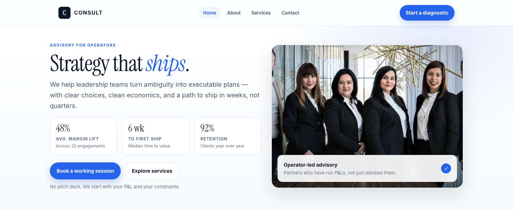

# Consulting HTML Template

A premium, framework-free HTML/CSS/vanilla-JS template for a boutique strategy advisory. Built bespoke from the subject — boardroom identity, not a recolored scaffold. Ink, slate, and electric blue; KPI cards, dark approach loop, and deck-slide reveals.

**Live preview:** `index.html` (open in browser)  
**Stack:** HTML5 · CSS3 (custom properties, Grid, Flex) · Vanilla JS (no build step)  
**Fonts:** Instrument Serif (display) · Inter (body) · Newsreader (fallback serif) — via Google Fonts  
**License:** MIT — use commercially, modify freely.

---

## 📸 Screenshot



## Pages

| Page | Description | Link |
|------|-------------|------|
| **Home** | Hero (KPIs + badge media), services trio, dark approach loop, case snapshots, advisors, insights, gradient CTA | [index.html](index.html) |
| **About** | Story + KPIs, dark approach loop, principles trio, team (3), timeline + CTA | [about.html](about.html) |
| **Services** | Three practices (Growth/Operations/Organization), approach loop, case snapshots, engagement shape + CTA | [services.html](services.html) |
| **Contact** | Working-session form (`[data-form]` + `.form-ok/.form-err`) + contact info + process timeline | [contact.html](contact.html) |

---

## Design Distinction

**This template was authored fresh for a consulting/business subject and diverges from sibling templates on all 6 divergence axes:**

| Axis | CONSULT (this template) | Siblings (SUCRÉ, FORGE, MERIDIAN, CHEFER) |
|------|-------------------------|--------------------------------------------|
| **Hero composition** | Two-column **boardroom hero**: eyebrow + serif display with blue italic `em` + lead on the left, KPI 3-up (`data-count`) + CTAs below; **media card** (4/3, badge with tick) on the right. Ink/slate + blue accent. | SUCRÉ: floating counter card with sprinkle dots. FORGE: blueprint grid + spec sheet. MERIDIAN: masthead + ticker + lead. CHEFER: chef portrait + dish. None use KPI cards or a badge-anchored media card. |
| **Layout grammar** | **Advisory dossier**: header (sticky blur, pill nav) → hero → services trio → dark approach loop (3 steps, bar) → case cards → advisors → insights → gradient CTA → dark footer. Every section reads like a working dossier. | SUCRÉ: ribbon → counter → offer band → menu board. FORGE: spec bar → hazard stripe → blueprint cards. MERIDIAN: editorial multi-column. CHEFER: menu + chef. None use an approach loop or case snapshot cards. |
| **Typography personality** | **Instrument Serif** (sharp, editorial display) + **Inter** (body). `display` class with tight tracking (-.02em), eyebrow (11px, .14em, blue), italic `em` for the hero hook. | SUCRÉ: Fraunces + DM Sans + Caveat hand. FORGE: Chakra Petch industrial. MERIDIAN: Newsreader/Archivo newsprint. CHEFER: serif + sans. No sibling uses Instrument Serif + blue italic hook. |
| **Color logic** | **Ink / slate / muted / blue / blue-soft** — deep navy ink, slate body, electric blue primary with soft wash and ring, 16px radius, pill buttons, soft shadows. Dark approach/CTA/footer provide contrast. | SUCRÉ: cream/cocoa/raspberry/butter. FORGE: safety yellow/steel/rust. MERIDIAN: paper/ink/accent red. CHEFER: warm chef palette. None use ink + electric blue system with dark loop + gradient CTA. |
| **Motion signature** | **Deck slide from right** — `translateX(24px)` → none (500ms ease). **Count-up** — `requestAnimationFrame` eased numbers for KPIs/steps (`[data-count]`). Threshold 0.14 reveals + 0.5 counters. | SUCRÉ: sugar pop + float 4.5s. FORGE: hazard stripe shift 1.2s. MERIDIAN: ticker + clip-path wipe. CHEFER: fade-up. None use horizontal slide or count-up. |
| **Section inventory** | Sticky header → hero (KPIs) → services (3, icon + bullets) → approach (dark, 3 steps) → cases (3, pills) → team (3, chips) → posts (3, pills) → gradient CTA (blue→indigo→sky) → footer (4-col). Cases + posts are sibling-unique. | SUCRÉ: ribbon + counter + offer + menu board + micro-cart. FORGE: portfolio filterbar + spec-list. MERIDIAN: ticker + feed + rail. CHEFER: dishes + chef bio. No sibling has approach loop + case snapshots + insights posts. |

**Bottom line:** Strip the colors from CONSULT and any sibling — they share zero layout grammar, component set, or motion vocabulary. This is a boardroom dossier, not a patisserie counter, jobsite, or newspaper.

---

## Features

- **Boardroom hero** — KPI 3-up with `data-count` count-up + badge-anchored media card
- **Service trio** — icon pill + bullets + link, hover via card shadow
- **Dark approach loop** — Diagnose → Design → Deliver, 3 steps with bar + count
- **Case snapshots** — image + pills + foot metrics, hover scale
- **Team cards** — portrait + role + chips
- **Insights posts** — image + pill + title, link to services
- **Gradient CTA** — blue → indigo → sky, radial highlight, ghost + dark buttons
- **Contact form** — `[data-form]` with `.form-ok` / `.form-err`, required name/email/message, no `alert()`
- **Sticky header** — backdrop blur, pill nav, burger drawer at 720px, auto-active via `location.pathname`
- **Scroll reveals** — IntersectionObserver, `.reveal.in` deck slide from right
- **Footer year** — `[data-year]` auto-fills current year
- **Reduced motion** — disables reveals, keeps content visible
- **Original imagery** — 9 source images in `assets/img/`: `carousel-1..2.jpg`, `blog-1..3.jpg`, `team-1..3.jpg`, `Consult.jpg`

---

## Quick Start

```bash
# No install, no build — just open
open index.html
# or serve locally
npx serve .
```

---

## File Structure

```
consulting-html-template/
├── index.html          # Home
├── about.html          # About — story, approach, team, timeline
├── services.html       # Services — 3 practices + cases + engagement shape
├── contact.html        # Contact — working-session form + info
├── assets/
│   ├── css/
│   │   └── base.css    # Bespoke design system
│   ├── js/
│   │   └── main.js     # Bespoke interactions
│   └── img/            # 9 original images (carousel, blog, team, Consult)
└── README.md           # This file
```

---

## Customization

- **Colors:** Edit `:root` tokens in `assets/css/base.css` — `--ink`, `--slate`, `--muted`, `--blue`, `--blue-700`, `--blue-soft`, `--accent`
- **Fonts:** Swap Google Fonts `@import` in `assets/css/base.css` and update `.display` / `body` families
- **Sections:** Add/remove `.service-card`, `.case`, `.person`, `.post`, `.approach`, `.cta` blocks
- **KPIs:** Duplicate `.kpi` inside `.kpis`, set `data-count` / `data-suffix` / `data-prefix` for count-up
- **Form:** Edit fields in `contact.html` — validation is `FormData` + regex + inline `.form-ok/.form-err` (see `assets/js/main.js`)
- **Header/Footer:** Edit `.header__inner` + `.mobile` + `.footer__grid` — keep `[data-nav]` and `[data-year]` for JS

---

## Browser Support

Modern evergreen browsers (Chrome 90+, Firefox 88+, Safari 14+, Edge 90+).  
Graceful degradation: CSS custom properties, Grid, Flex, `clamp()`, `IntersectionObserver`.

---

## Credits

- **Images:** Original source assets (included in `assets/img/`)
- **Fonts:** Instrument Serif, Inter, Newsreader — all SIL OFL via Google Fonts
- **Icons:** Inline Unicode (◈ ⬡ ◎ ✓) — no icon font

---

Let's Build Something Together 🚀  
https://tally.so/r/q4q1L9
